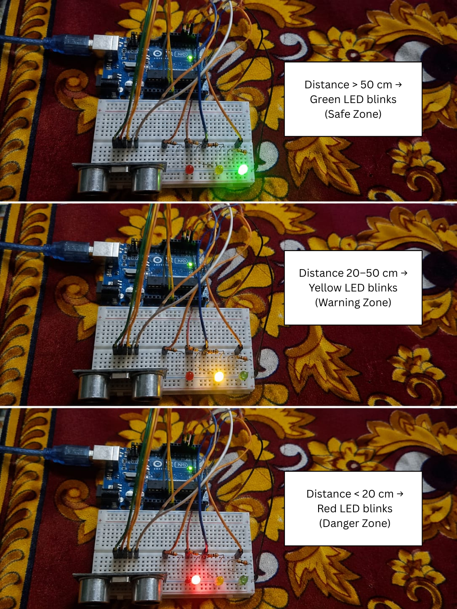

# ✈️ Aircraft Collision Alert System

## 📖 Overview
This project is developed using an Arduino Uno and an HC-SR04 Ultrasonic Sensor to simulate an aircraft collision alert system. The system detects nearby obstacles and provides visual alerts using LEDs.

## 🛠 Components Used
- Arduino Uno
- HC-SR04 Ultrasonic Sensor
- Green LED
- Yellow LED
- Red LED
- 3 × 220Ω Resistors
- Breadboard
- Jumper Wires

## ⚙️ Working
- 🟢 Green LED blinks when the distance is greater than **50 cm**.
- 🟡 Yellow LED blinks when the distance is between **20 cm and 50 cm**.
- 🔴 Red LED blinks when the distance is less than **20 cm**.

## 📁 Files
- Aircraft_Collision_Alert_System.ino
- project_image.png

## 🚀 Future Improvements
- Add buzzer for audio alerts.
- ## 📷 Project Images

### 🔹 Working Model

### 🔹 Circuit Diagram

- Display distance on an LCD.
- Wireless monitoring using IoT.

## 👨‍💻 Author
**Lokesh Tirupati**
